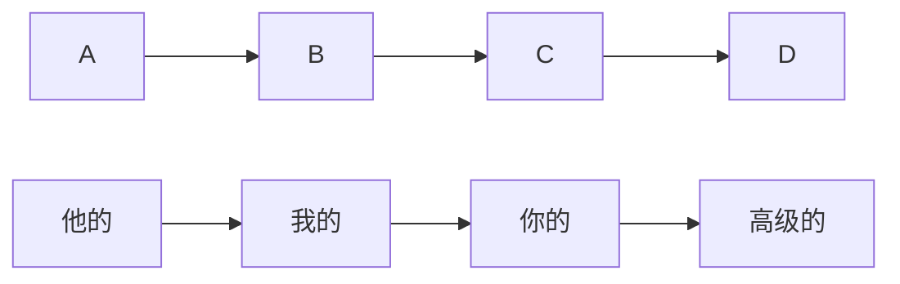
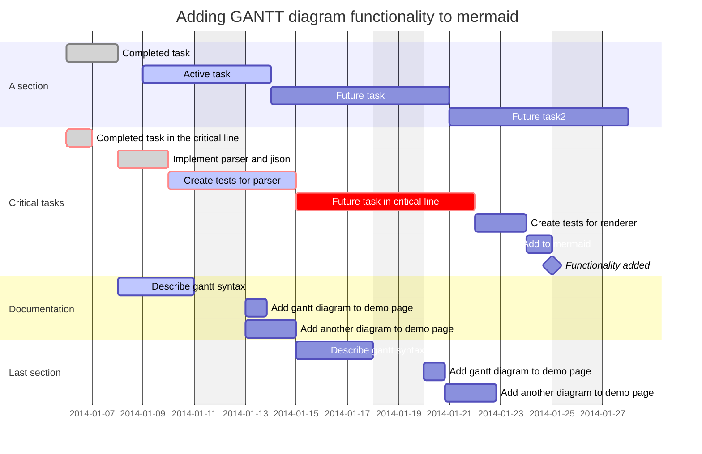

# 📖 Docsify Editor
🚀 **Docsify Editor**  is a simple web-based Markdown editor built with Docsify and EasyMDE, supporting real-time preview and optional server-side storage.




```javascript
function abc(){
		var test = 23;
		var test2 = 456;
		var hello = "23234234"
}
```

```powershell
Invoke-RestMethod "abc"
```

```bash
$ echo "hello"
cp aaa bbb
```



我的内容在这里

好吧，都在这里了

不要加载新的内容

## Filelist
[filelist](filelist.md ':include')